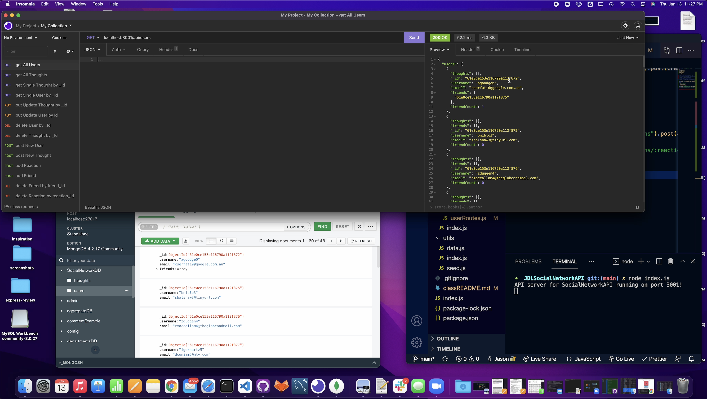

# JDLSocialNetworkAPI

[]

## Table of Contents

- [Description](#description)
- [Technologies Used](#technologies-used)
- [Demonstration](#demonstration)
- [Setup](#setup)
- [Usage](#usage)
- [Project Updates](#project-updates)
- [Project Status](#project-status)
- [Have any Questions](#questions)
- [License](#license)

## Project Status

#### The status of Project JDLSocialNetworkAPI is currently:

- ##### _complete_
- ###### The reason: Acceptance Criteria Met

## Project Updates

Front End Interface

## Demonstration

Live demo [_here_](https://drive.google.com/file/d/1TJkFG8wjS8f7c4XyUa5lOBwqI3Ta44hx/view?usp=sharing).

## Description

- an API for a social network web application where users can share their thoughts, react to friends’ thoughts, and create a friend list.

## Technologies Used

- Mongoose, Express

## Setup

To use this application, you must have the following technologies installed:

- Code Editor Application. Thats it.

## Usage

- node index.js

## Questions

This application was created by: 

- I encourage you to [send me an email](mailto:Jason.Lutz@du.edu)
  if you have any questions or comments.

## Contributors

Thank you to these GitHub users for thier contributions:

- https://github.com/LutzJason92

## License

- This appplication is currently using a mit license.
